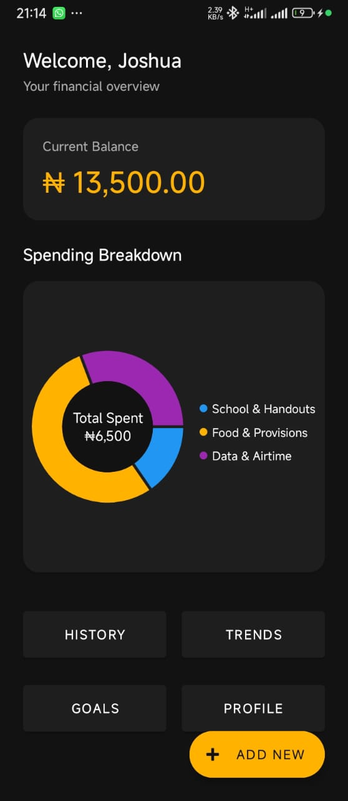
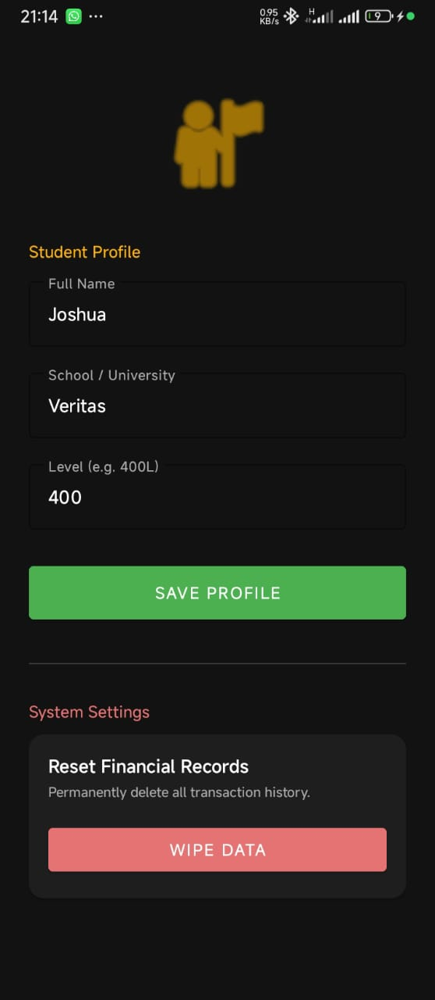
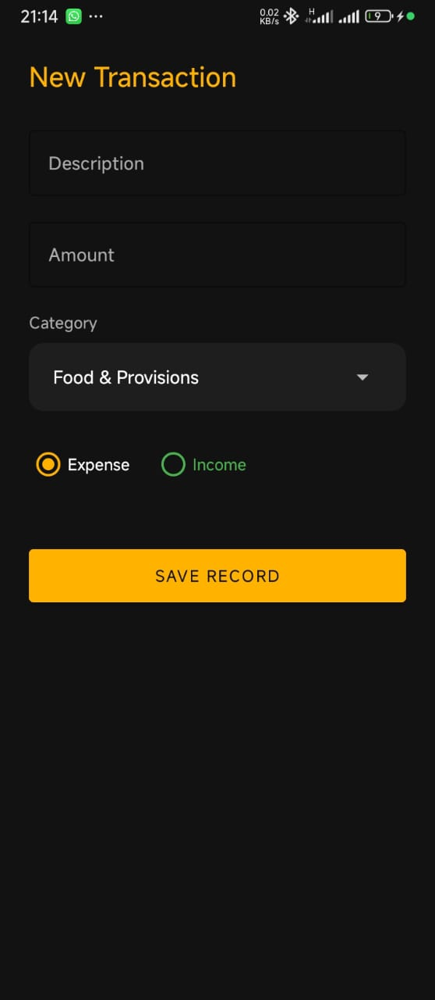

# UniSpend 📱💸
**The Ultimate Student Finance & Budget Manager**


## 📖 Project Overview
**UniSpend** is a native Android application built to help Nigerian university students navigate the challenges of financial independence.

Developed as a final year Computer Science project at Veritas University, this app moves beyond simple tracking. It helps students visualize their spending habits (Food, Handouts, Transport) and actively save towards specific goals (Laptop, Rent, Project Fees).

## ✨ Key Features
* **📊 Smart Dashboard:** See your total balance and monthly spending at a glance.
* **🎯 Goal Setting:** Create custom savings goals (e.g., "New Phone") and track progress with visual bars.
* **📉 Expense Analytics:** Interactive Pie Charts powered by `MPAndroidChart` to visualize where your money goes.
* **📝 Transaction History:** detailed logs of every naira spent or received.
* **⚡ Fast & Offline:** Built with a local `Room` database, ensuring the app works perfectly without internet.
* **👤 Student Profile:** Personalized welcome screen and user management.

## 📱 Screenshots
| Dashboard | Profile | Add Expense | Splash screen |
|:---:|:---:|:---:|:---:|
|  |  |  |  |

## 🎓 Solved Problems
UniSpend bridges the gap between financial chaos and stability for students:

| The Student Problem 😫 | The UniSpend Solution ✅ |
| :--- | :--- |
| *"I don't know where my money vanished to."* | **Transaction History** logs every Naira with timestamps. |
| *"I spend too much on Shawarma."* | **Visual Analytics** (Pie Charts) expose spending leaks instantly. |
| *"I can never save enough for a laptop."* | **Goals Feature** visualizes progress, motivating students to save. |
| *"Data is expensive, I can't be online always."* | **Offline Database** ensures the app works perfectly without data. |


## 🛠️ Technical Stack
This project adheres to modern Android development standards and the **MVVM (Model-View-ViewModel)** architecture.

* **Language:** [Kotlin](https://kotlinlang.org/)
* **Architecture:** MVVM (Model-View-ViewModel)
* **Local Database:** [Room Database](https://developer.android.com/training/data-storage/room) (SQLite)
* **Concurrency:** Kotlin Coroutines & Flow
* **UI Components:** XML, Material Design Components, CardView, RecyclerView
* **Charting:** [MPAndroidChart](https://github.com/PhilJay/MPAndroidChart)

## 🏗️ Architecture Overview
UniSpend separates the UI from the data logic to ensure clean, maintainable code:
1.  **Data Layer:** `GoalDao`, `ExpenseDao`, and `RoomDatabase` handle all SQL operations.
2.  **Repository:** `ExpenseRepository` acts as a single source of truth, managing data flow.
3.  **ViewModel:** `ExpenseViewModel` holds the UI state and survives configuration changes.
4.  **UI Layer:** Activities and Fragments observe `LiveData` from the ViewModel to update the screen automatically.

## 🚀 How to Run
1.  **Clone the Repository**
    ```bash
    git clone [https://github.com/YourUsername/UniSpend.git](https://github.com/YourUsername/UniSpend.git)
    ```
2.  **Open in Android Studio**
    * File > Open > Select the `UniSpend` folder.
3.  **Sync Gradle**
    * Allow Android Studio to download dependencies.
4.  **Run**
    * Connect a device or start an Emulator.
    * Click the green **Play** button.

## 🔮 Future Improvements
* **Cloud Sync:** Integration with Firebase for multi-device support.
* **Budget Limits:** Notifications when spending exceeds a set limit for "Food" or "Data".
* **PDF Export:** ability to download a monthly account statement.

## 👨‍💻 Author
**Joshua Vongdip**
* **Department:** Computer Science
* **Institution:** Veritas University, Abuja
* **Contact:** vongdipjoshua@gmail.com

---
*This project is submitted in partial fulfillment of the requirements for the award of a Bachelor of Science (B.Sc) degree in Computer Science.*
